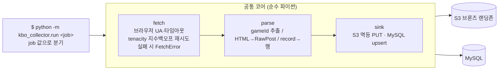
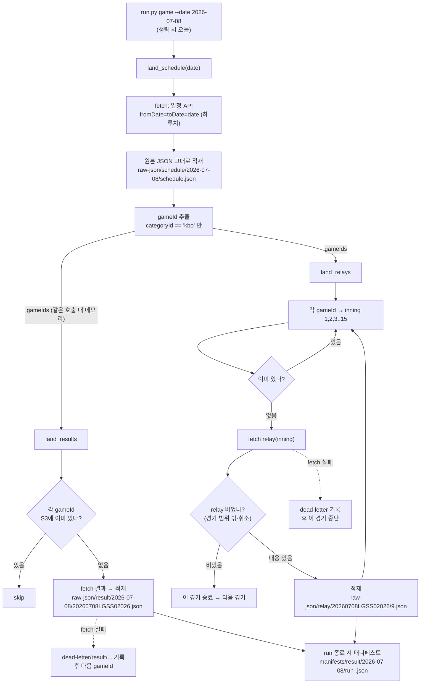
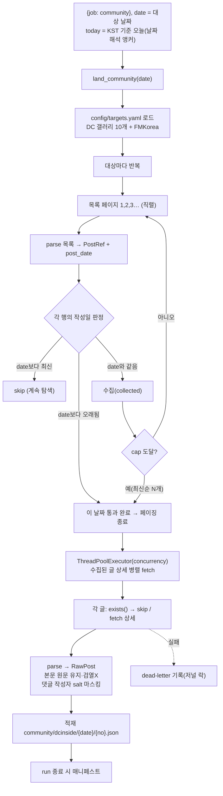

# 크롤링 플로우 (경기·커뮤니티 → S3, 로스터·경기기록 → MySQL)

> 수집 로직을 그림으로 정리한 문서입니다. 실제 코드(`kbo_collector/run.py`의 `land_*` 함수)를
> 반영했으며, S3 키는 이해를 돕기 위해 **실제 예시값**으로 표기했습니다.

수집물은 성격에 따라 **두 싱크**로 나뉩니다.
- **S3**: 경기 원본 JSON(schedule → gameId → result/relay 연쇄) + 커뮤니티 글(날짜 기준 페이징 수집).
- **MySQL**: 구단·1군 로스터(`registrations`, KBO 공식사이트) + 경기 박스스코어(`records`, 네이버 record API를 파싱·정규화).

실행은 **CLI**(`python -m kbo_collector.run <job>`), 처리 로직은 오케스트레이션 비의존 **코어**가 담당합니다.

---

## 1. 전체 개요 — CLI job → 코어 → 싱크

> `job` 값으로 분기: `schedule|result|relay|game|community|all`은 **S3**, `teams|registrations|records`는 **MySQL 싱크**(`DbSink`)로 흐릅니다 → 4절.

---

## 2. 경기 데이터 — schedule → result / relay (한 번의 실행 안에서)

**포인트**
- `game` 잡 한 번의 실행 안에서 schedule→result→relay가 순차 실행됩니다(gameId는 **메모리로 전달**).
- `land_schedule`은 체크포인트 없이 **항상 재fetch**합니다(gameId를 얻어야 하므로). 원본은 매번 같은 키에 멱등 적재.
- 네이버 API는 `fromDate`를 넓게 줘도 **하루치만** 반환 → 한 달치는 날짜를 바꿔 반복(`--date`로 과거 날짜 backfill).
- relay는 이닝을 1부터 올려 fetch하다 **빈 이닝**(경기 범위 밖·취소)을 만나면 그 경기를 종료.

---

## 3. 커뮤니티 — 날짜 기준 목록 페이징 + 상세 병렬 수집

**포인트**
- 목록은 **날짜 내림차순** → `date`보다 **오래된 첫 글**에서 페이징 종료(그 뒤는 전부 더 과거). 목표 날짜에 작성된 글만 수집.
- 목록 페이징은 **직렬**(날짜 조기중단이 페이지 순서에 의존), **상세 fetch만 병렬**(`--concurrency`). 저널 파일 쓰기만 `threading.Lock`으로 보호.
- `--cap N`: 대상별 최신순 N개까지만(대형 갤러리 폭주 방지, `0`=무제한). `--source A,B`: 특정 소스만.
- `exists()` 체크포인트로 이미 적재된 글은 상세 fetch 없이 skip. FMKorea는 Cloudflare 차단으로 0건일 수 있음.

---

## 4. 로스터·경기기록 — MySQL 적재 (registrations / records)

```mermaid
flowchart TD
    subgraph REG["registrations (KBO 공식 → MySQL)"]
      RA["land_registrations(date)"] --> RB["current_date(): 사이트 현재 등록일"]
      RB --> RC["구단 10개 반복<br/>Register.aspx POST(팀·날짜)"]
      RC --> RD["parse_register: 1군 명단·포지션"]
      RD --> RE["upsert players(현재상태)<br/>+ player_registrations(일자 스냅샷)"]
      RE --> RF["현재일이면 미등록 선수 is_first_team=false 스윕"]
    end
    subgraph REC["records (네이버 record → MySQL)"]
      CA["land_game_records(date)"] --> CB["schedule(date) → 완료·표준팀 경기만"]
      CB --> CC["각 gameId: /record fetch"]
      CC --> CD["parse_record → Game·Pitching·Batting·PlayerRef"]
      CD --> CE["upsert_game_players: pcode→player_uid 발급"]
      CE --> CF["upsert games·innings·pitching·batting"]
      CF -. "한 경기 실패" .-> CG["경고 로그 + 실패 gameId만 수집(계속)"]
      CB2["--from/--to 구간 반복"] --> CA
      CF --> CH["구간 끝: kbo_player_id 링크(이름+팀 유일매칭)"]
    end
```

**포인트**
- 둘 다 **upsert 멱등** — 재실행/재백필 안전. `players`·`games` 등은 `ON DUPLICATE KEY UPDATE`.
- `registrations`는 하루 1회 = 그날 **1군 등록 스냅샷**. `records`는 종료 경기의 최종 박스스코어(과거 시즌 백필 가능).
- 선수 식별은 네이버 `pcode`가 아니라 **자체 `player_uid`**. `game_players`가 pcode↔uid↔(로스터)kbo_player_id 매핑을 소유.
- 스케줄 조회는 날짜에 **대시 필수**(`fromDate=2026-03-28`).

---

## 공통 복원력 장치

| 장치 | 동작 | 위치 |
|---|---|---|
| **멱등 키 / upsert** | S3는 콘텐츠 키로 덮어씀 · MySQL은 `ON DUPLICATE KEY UPDATE`로 재실행 안전 | `keys.py` / `db.py` |
| **체크포인트** | 적재 전 `exists()` → 있으면 skip (중단돼도 이어서 재개) | result / relay / community |
| **재시도** | tenacity 지수백오프 N회, 최종 실패 시 `FetchError` | `fetch.py` |
| **dead-letter / 경기 격리** | 1건 실패 → 격리 기록 후 **다음으로 계속** (records는 실패 gameId만 수집) | 각 잡 루프 |
| **매니페스트·메타** | (S3) run별 적재 키 목록 + 오브젝트에 `run-id`/`job` 메타 | `sink.py`, `run.py` |

---

## 관련 문서

- 적재되는 JSON의 필드/구조: [`data-formats.md`](./data-formats.md)
- 현재 크롤링 개요(미팅용): [`current-crawl-overview.md`](./current-crawl-overview.md)
- 실행용 노트북: [`../notebooks/run_crawler.ipynb`](../notebooks/run_crawler.ipynb)
