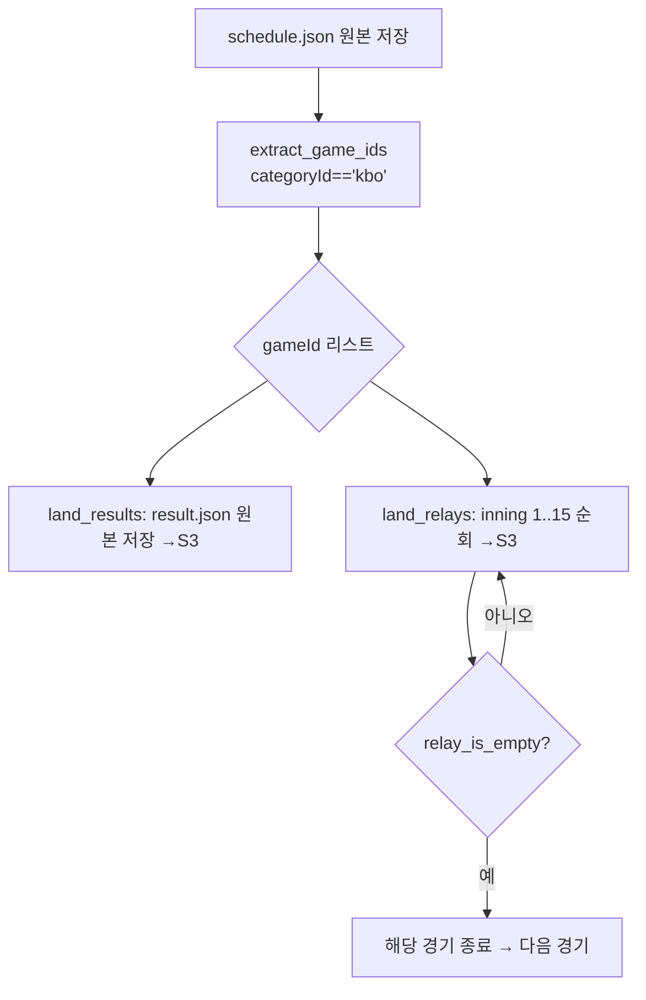
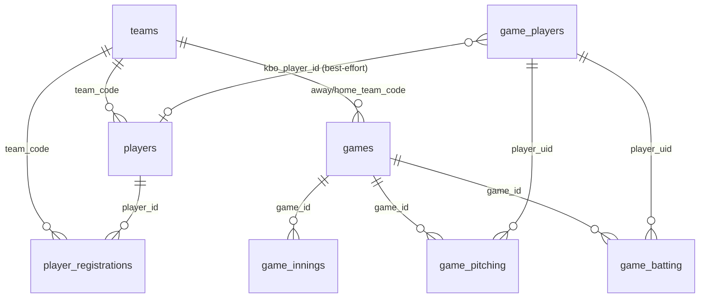
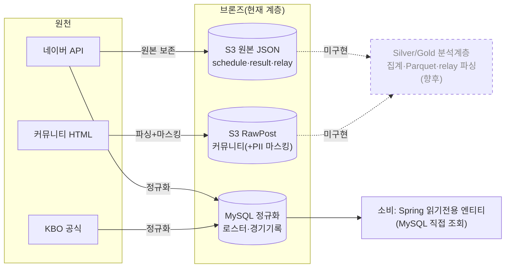

# 현재 크롤링 개요 (미팅용)

> KBO 크롤러(`py-collector`)가 **현재** 무엇을 어떻게 수집하는지 — 기술 스택 · 데이터 소스 · 파싱 방식 · 저장 값(S3 & MySQL) · 데이터 규격 — 을 한 장에 정리한 문서. 모든 내용은 실제 코드(`kbo_collector/*.py`, `deploy/sql/schema.sql`) 근거.

**목차**
1. [기술 스택 & 수집 아키텍처](#1-기술-스택--수집-아키텍처)
2. [크롤링 전략](#2-크롤링-전략)
3. [데이터 소스 & job](#3-데이터-소스--job)
4. [파싱 방식](#4-파싱-방식)
5. [저장 값 & 데이터 규격 (S3 · MySQL)](#5-저장-값--데이터-규격-s3--mysql)
6. [데이터 처리 파이프라인](#6-데이터-처리-파이프라인)

---

# 1. 기술 스택 & 수집 아키텍처

공통 수집 코어(`kbo_collector.run.land_*`)를 **CLI**(`python -m kbo_collector.run <job> [옵션]`)로 실행한다. 수집물은 성격에 따라 **두 개의 싱크**로 나뉜다.

- **S3** — 원천 응답을 가공 없이 **멱등** 적재(raw landing): 경기 일정/결과/문자중계 원본 JSON, 커뮤니티 글.
- **MySQL** — 정규화가 필요한 정형 데이터: 구단·선수 로스터, 경기 박스스코어(누가 던지고 쳤는지).

---

# 2. 크롤링 전략

수집 대상마다 **데이터의 성격(불변/가변, 발생 시점)** 이 달라서, 소스·주기·모드를 데이터별로 다르게 잡았다.

## 소스 선택 근거

| 소스 | 왜 이 소스인가 |
|---|---|
| **네이버 스포츠 API** | 경기 데이터(일정·결과·중계·박스스코어)를 **단일 창구**로 안정적 JSON 제공. **종료 경기도 영구 조회**돼 과거 시즌 백필 가능 |
| **KBO 공식 사이트** | 1군 등록 명단은 네이버에 없음 → **일자별 제출**되는 공식 등록현황의 유일한 신뢰 소스 |
| **DCInside · FMKorea** | 팬 반응·여론 신호. DCInside는 **구단별 갤러리**라 팀 단위 세그먼트가 자연히 확보됨 |

## 데이터별 수집 주기·모드

| 데이터 | 성격 | 수집 주기 | 모드 |
|---|---|---|---|
| schedule/result/relay | 종료 후 **불변** | 경기일 기준 | 종료 후 1회면 충분(멱등 재실행 무해) |
| **records**(박스스코어) | 종료 후 **불변** | 종료 경기 | 확정 1회 + 과거 **백필**(`--from/--to`) |
| **registrations**(로스터) | **매일 변동** | **하루 1회** | 그날의 1군 등록 스냅샷 |
| **community** | 계속 생성 | 목표 날짜 | 날짜 기준 페이징 + **새 글 증분** |

## 증분 · 백필 · 예의(politeness)

- **증분 수집**: ① community는 목록이 날짜 내림차순이므로 **목표일보다 오래된 첫 글에서 페이징 종료** + `exists()`로 이미 받은 글 skip → 매 실행 새 글만. ② records/roster는 **upsert**라 재수집해도 갱신만.
- **백필**: `--date`(하루) / `--from --to`(구간)로 과거를 채운다. 네이버 API가 조회 시 하루치만 반환하므로 날짜를 돌며 반복.
- **차단 회피 / 예의**: 요청 간 `fetch_delay_ms` 지연, 브라우저 UA + Referer 헤더, **목록은 직렬·상세만 병렬**(`--concurrency` 상한), 대형 갤러리는 `--cap`으로 상한, 429/5xx는 tenacity 지수 백오프.
- **부분 성공을 정상으로**: 1건 실패가 전체를 막지 않도록 dead-letter·경기 단위 격리 → "빈틈은 남기되 실행은 끝까지".

---

# 3. 데이터 소스 & job

## 데이터 소스 3곳

| 소스 | 무엇을 | 형식 | 싱크 |
|---|---|---|---|
| **네이버 스포츠 API** (`api-gw.sports.naver.com`) | 일정·결과·문자중계·**박스스코어(record)** | JSON | S3(일정/결과/중계) · MySQL(record) |
| **KBO 공식 사이트** (`koreabaseball.com` `Player/Register.aspx`) | 구단별 1군 등록 선수 명단·포지션 | HTML(ASP.NET) | MySQL |
| **FMKorea / DCInside** | 커뮤니티 글·반응·상위 댓글 | HTML | S3 |

## job 종류

| job | 하는 일 | 싱크 |
|---|---|---|
| **schedule** | 날짜별 경기 일정 JSON 적재 + gameId 추출 (`land_schedule`) | S3 |
| **result** | gameId별 경기 결과 JSON 적재(존재 시 skip) (`land_results`) | S3 |
| **relay** | gameId × 이닝(1~15) 문자중계 적재, 빈 이닝이면 다음 경기로 (`land_relays`) | S3 |
| **game** | 하루 경기 3종: schedule → result → relay | S3 |
| **community** | FMKorea/DCInside **날짜 기준** 목록 페이징 → 상세 **병렬** 수집, 마스킹·상위 댓글 (`land_community`) | S3 |
| **all** | schedule → result → relay → community 전체 | S3 |
| **teams** | 10개 구단 시드 upsert (`db.upsert_teams`) | MySQL |
| **registrations** | KBO Register.aspx 1군 등록명단 → `players` / `player_registrations` (`land_registrations`) | MySQL |
| **records** | 네이버 record API 박스스코어 → `games`/`game_innings`/`game_pitching`/`game_batting`/`game_players`. `--from/--to`로 시즌 백필 (`land_game_records`) | MySQL |

> `schedule`은 result/relay·game·all 앞에서 항상 선행 실행되어 gameId를 공급.
> `records`·`registrations`는 일자 단위(`--date`) 또는 구간(`--from/--to`) 실행. `records` 백필 마지막에 `game_players.kbo_player_id`를 로스터와 이름+팀 유일매칭으로 링크.

### 커뮤니티 job 옵션(신규)

| 옵션 | 의미 |
|---|---|
| `--cap N` | 대상별 상세수집 최대 글 수(최신순). `0`=무제한 (대형 갤러리 폭주 방지) |
| `--concurrency N` | 대상별 상세 fetch 동시성(스레드). `1`=직렬 |
| `--source A,B` | 특정 소스만 크롤(예: `FMKOREA`) |
| `--delay-ms N` | 요청 간 예의 딜레이(ms) 오버라이드 |

목록 페이징은 **직렬**(날짜 조기중단이 페이지 순서에 의존), 상세 fetch만 `ThreadPoolExecutor`로 **병렬**. 저널 파일 쓰기만 `threading.Lock`으로 직렬화.

---

# 4. 파싱 방식

## 4-1. 네이버 JSON 파싱

schedule/result/relay는 **원본 JSON을 그대로** S3에 저장하고, 애플리케이션 파싱은 `naver.py`에 딱 두 가지.

**(a) `extract_game_ids` — KBO 1군 경기만 gameId 추출**
```python
return [g["gameId"] for g in games
        if g.get("categoryId") == "kbo" and g.get("gameId")]
```
**(b) `relay_is_empty` — 빈 이닝이면 경기 수집 종료** (`textRelayData.textRelays` 없거나 빈 배열 → `True`)

**record(박스스코어)**는 예외적으로 S3가 아니라 **파싱해서 MySQL에 정규화** 적재 → 아래 4-3.



## 4-2. KBO 공식사이트 파싱 — 선수 로스터 (`kbo_register.py`)

`Player/Register.aspx`는 **ASP.NET WebForms**. GET으로 `__VIEWSTATE`·`__VIEWSTATEGENERATOR`·`__EVENTVALIDATION` 히든값을 얻은 뒤, 팀코드(`hfSearchTeam`)·날짜(`hfSearchDate=YYYYMMDD`)를 실어 POST. 응답은 **UTF-8**.

- `parse_register(html)` — 테이블 순회, 2번째 `<th>`가 포지션 섹션(투수/포수/내야수/외야수)인 표만 선택(감독/코치 제외). 각 행에서 `playerId`(href 정규식 `playerId=(\d+)`), 이름, 등번호, 포지션, 투타, 생년월일, 신체(cm/kg) 추출 → `PlayerRow`.
- `current_date()` — 사이트 기본 `hfSearchDate`(=현재 등록일)를 읽어 스냅샷 날짜로 사용.
- 하루 1회 크롤 → **그날의 1군 등록 스냅샷**. `players`(현재상태) + `player_registrations`(일자별 스냅샷) 두 테이블을 동시에 갱신.

## 4-3. 네이버 record 파싱 — 경기 박스스코어 (`game_records.py`)

일자별 스케줄에서 **완료(RESULT)·표준 10구단** 경기만 추린 뒤(`list_finished_games` — 올스타전/취소 제외), 각 gameId의 `/record`를 파싱.

| 함수/로직 | 내용 |
|---|---|
| `parse_record(gameId, recordData)` | `GameRow`(경기 메타·스코어·승자·선발) + 하위 `PitchingRow[]`·`BattingRow[]`·`PlayerRef[]` |
| `innings_to_outs("6 ⅓")` | 이닝 표기(유니코드 분수) → 아웃 수(`6 ⅓`→19) |
| 승패 판정 | `pitchingResult[].wls`(W/L/S/H) → 투수별 decision |
| 승자 판정 | `scoreBoard.rheb.away.r` vs `home.r` → away/home/draw |
| 경기 유형 | `gameInfo.gameFlag` `0`=regular / `1`=preseason |

### 선수 식별 체계 (독자 매핑)

네이버 `pcode`에 종속되지 않도록 **자체 `player_uid`(surrogate)** 발급.
- `game_players.naver_pcode` = 소스 매핑키 → `upsert_game_players`가 pcode→uid 부여
- `game_players.kbo_player_id` = 기존 1군 로스터(`players`)와 이름+팀 **유일매칭** best-effort 링크(동명이인은 미링크)

## 4-4. 커뮤니티 HTML 파싱

소스별 **목록 파서 → 상세 파서** 2단계, `BeautifulSoup(html, "lxml")`. 목록은 **날짜 내림차순**이므로 목표 날짜(KST 기준 today 앵커)보다 오래된 첫 글에서 페이징을 멈춘다(`_collect_refs_for_date`).

**FMKorea — 셀렉터 → 필드**

| 단계 | CSS 셀렉터 | 필드/로직 |
|---|---|---|
| 목록 행 | `table.bd_lst tbody tr` | `notice` skip · `td.time`으로 날짜 판정 |
| 목록 링크 | `td.title a` | 제목, href `/(\d+)` → `post_id` |
| 본문 | `.rd_body div[class^=document_].xe_content` | `body` |
| engagement | `.side.fr span` | 조회/추천/댓글 (dislike=null) |
| 댓글 | `ul.fdb_lst_ul li.fdb_itm` → `.comment-content` | 본문 + `.meta a.member_plate` 작성자 마스킹 |

**DCInside — 셀렉터 → 필드**

| 단계 | CSS 셀렉터 | 필드/로직 |
|---|---|---|
| 목록 행 | `tr.ub-content` | `td.gall_num` 숫자 아니면 skip · `gall_date title`로 날짜 |
| 목록 링크 | `td.gall_tit.ub-word a` | 제목, `no=`→post_id, `id=`→갤러리 |
| 본문 | `.write_div` | 광고/스크립트 제거 후 텍스트 |
| engagement | `.gall_count`/`.up_num`/`.down_num`/`.gall_comment a` | view/like/dislike/comment |
| 댓글 | (AJAX) | `topComments = []` 고정 |

**작성자 마스킹** (`masking.py`): `sha256(f"{salt}:{author}")[:12]`. 원문 핸들 미저장, 같은 작성자→같은 토큰. **댓글 작성자만** 마스킹, **본문·제목은 무필터**.

---

# 5. 저장 값 & 데이터 규격 (S3 · MySQL)

## 5-1. S3 키 레이아웃

| 데이터 | S3 키 패턴 | 단위 |
|--------|-----------|------|
| schedule | `raw-json/schedule/{yyyy-MM-dd}/schedule.json` | 날짜 1파일 |
| result | `raw-json/result/{yyyy-MM-dd}/{gameId}.json` | 경기 1파일 |
| relay | `raw-json/relay/{gameId}/{inning}.json` | 경기×이닝 1파일 |
| community | `community/{source}/{yyyy-MM-dd}/{postExternalId}.json` | 글 1파일 |
| dead-letter | `dead-letter/{job}/{yyyy-MM-dd}/{itemId}.json` | 실패 1파일 |
| manifest | `manifests/{job}/{yyyy-MM-dd}/{runId}.json` | 실행 1파일 |

**저장 데이터 성격**: schedule/result/relay는 네이버 원본 JSON **byte-for-byte**(스키마 소유=네이버), 커뮤니티 `RawPost`는 우리 통일 스키마(`schemaVersion=2`). 상세 필드는 `data-formats.md` 참고.

## 5-2. MySQL 스키마 (`deploy/sql/schema.sql`)

### 로스터 (소스: KBO 공식)

| 테이블 | 주요 컬럼 | 의미 |
|---|---|---|
| `teams` | `team_code`(PK), `name`, `full_name` | 10개 구단 (OB LG SS KT WO HT HH NC LT SK) |
| `players` | `player_id`(KBO id, PK), `name`, `team_code`, `back_number`, `position`, `throw_bat`, `birth_date`, `height_cm`, `weight_kg`, `is_first_team`, `last_registered_on` | 선수 마스터(현재상태). 현재상태 필드는 `D>=last_registered_on`일 때만 전진 |
| `player_registrations` | `snapshot_date`+`player_id`(PK), `team_code` | **일자별 1군 등록 스냅샷** → 특정 날짜 등록현황 조회 |

### 경기 기록 (소스: 네이버 record)

| 테이블 | 주요 컬럼 | 의미 |
|---|---|---|
| `games` | `game_id`(PK), `game_date`, `game_type`(regular/preseason), `round_no`, `stadium`, `start_time`, `away/home_team_code`, `away/home_score`, `away/home_hits`, `away/home_errors`, `away/home_bb`, `winner`, `away/home_starter_uid` | 경기 1행. 스코어·R/H/E/BB·선발·승자 |
| `game_innings` | `game_id`+`is_home`+`inning`(PK), `runs` | 이닝별 득점(라인스코어) |
| `game_pitching` | `game_id`+`player_uid`(PK), `team_code`, `is_home`, `seq`(0=선발), `decision`(W/L/S/H), `ip_display`, `ip_outs`, `batters_faced`, `at_bats`, `hits`, `runs`, `earned_runs`, `home_runs`, `walks_hbp`, `strikeouts` | 투수별 등판 기록 |
| `game_batting` | `game_id`+`player_uid`(PK), `team_code`, `is_home`, `bat_order`, `position`, `at_bats`, `runs`, `hits`, `home_runs`, `rbi`, `walks`, `strikeouts`, `stolen_bases` | 타자별 기록 |
| `game_players` | `player_uid`(PK, 자체 surrogate), `naver_pcode`(UNIQUE), `name`, `team_code`, `kbo_player_id` | 경기 등장 선수의 **독자 식별자** + 소스/로스터 매핑 |

### 적재 현황 (2026 시즌, 07-14 기준)

| 테이블 | 건수 |
|---|---:|
| games | 448 (정규 423 + 시범 25) |
| game_innings | 7,940 |
| game_pitching | 4,404 |
| game_batting | 11,579 |
| game_players | 574 (그중 로스터 링크 279) |
| teams / players / player_registrations | 10 / 281 / 281(07-13 스냅샷) |



## 5-3. 실행 추적 (S3)

키는 콘텐츠 기반 멱등이라 `run_id`를 데이터 키에 넣지 않음. 대신 **S3 user metadata**(`run-id`,`job`) + **manifest JSON** + **dead-letter JSON**으로 가변 실행 이력을 분리. (MySQL 경로는 upsert 멱등이라 별도 매니페스트 없음.)

---

# 6. 데이터 처리 파이프라인

수집물을 **어디까지 가공하느냐**를 데이터 성격에 따라 둘로 나눴다. 원본 가치가 크고 스키마가 방대한 것은 미가공 보존, 바로 질의·조인이 필요한 것은 적재 시 정규화한다.

## 두 가지 처리 모드

| 모드 | 대상 | 무엇을 | 이유 |
|---|---|---|---|
| **원본 보존 (schema-on-read)** | 네이버 schedule/result/relay | 응답 **byte-for-byte** S3 적재, 가공 0 | 원본 손실 방지·스키마 결합 최소화. 필요한 필드 추출은 **분석 시점으로 미룸** |
| **적재 시 정규화 (schema-on-write)** | record · 로스터 · 커뮤니티 | 파싱→정형화해 MySQL/RawPost로 | 즉시 질의·조인·집계가 필요 |



## 지금까지 처리된 것 · 아직 아닌 것

- ✅ **완료(Bronze)**: 네이버 원본 S3 적재 · 커뮤니티 RawPost(마스킹) · 로스터/경기기록 MySQL 정규화. 소비는 **Spring 읽기전용 엔티티가 MySQL 직접 조회**.
- ⬜ **미구현(향후)**: S3 브론즈 → **Silver/Gold 분석 계층**(집계·Parquet 컬럼형 변환), `relay` play-by-play 파싱, 커뮤니티 텍스트 분석(감성·이슈). 원본은 이미 보존돼 있어 **소급 처리 가능**.

## 질문 생성 인계 계층 (question-source)

소스 플러그인(`kbo_collector/sources/`)이 수집한 데이터를 exporter(`kbo_collector/exports/`)가
**통일 envelope(v1)** JSON으로 S3 `question-source/{docType}/{date}/`에 적재한다.
분석자·질문 생성기는 envelope 공통 필드(`entities`·`title`·`content`·`tags`)만 소비하므로
**소스가 늘어도 소비자 코드는 불변**이다. content는 결정적 템플릿 렌더링(LLM 미사용).
초기 docType: `game_result` `player_profile` `community_post` `player_meme`.
소스 추가 = `sources/` 모듈 1개 + `@register` (스펙: `docs/superpowers/specs/2026-07-15-question-source-architecture-design.md`)

---

> **관련 문서**: 네이버 API 응답 상세 필드 → `data-formats.md` · 플로우 다이어그램 → `crawl-flow.md`
